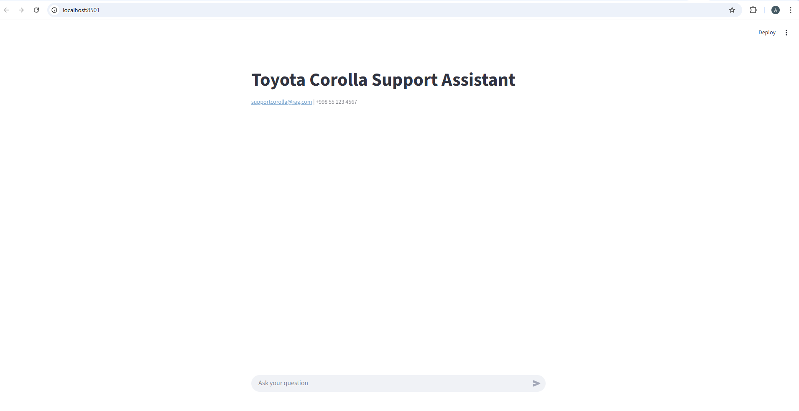
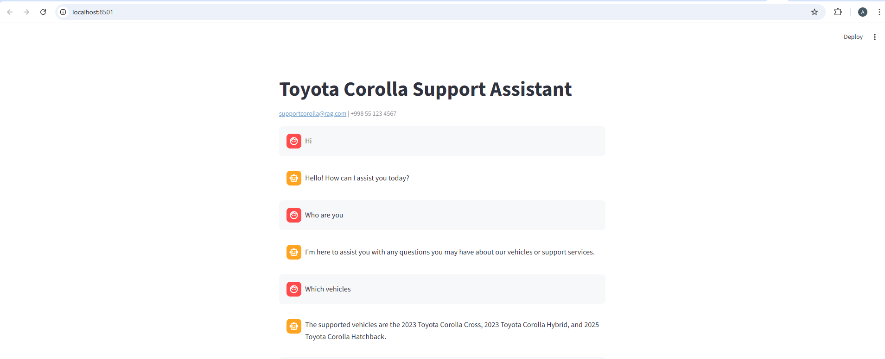
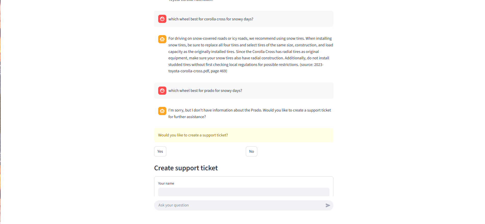
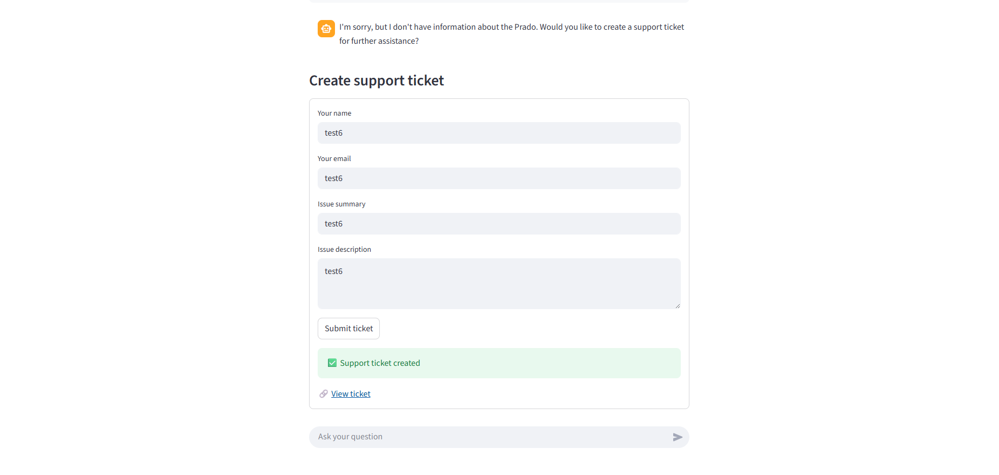
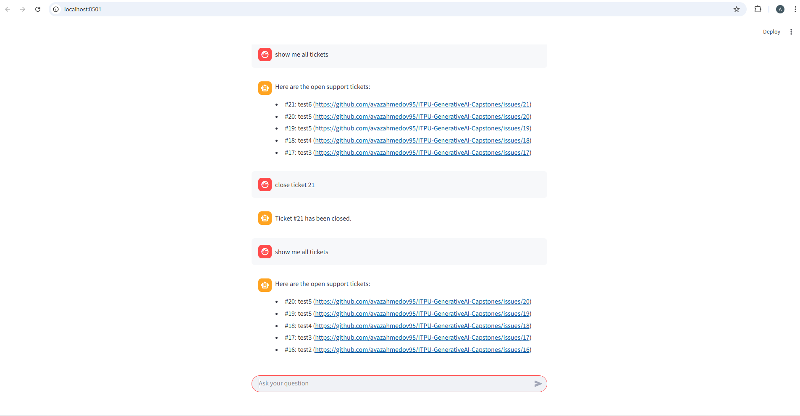
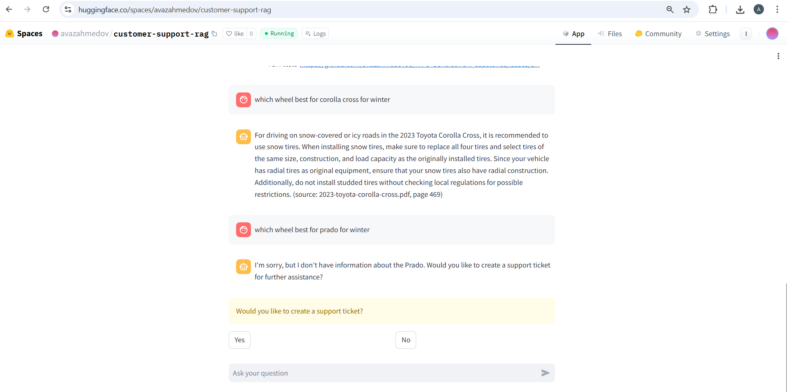
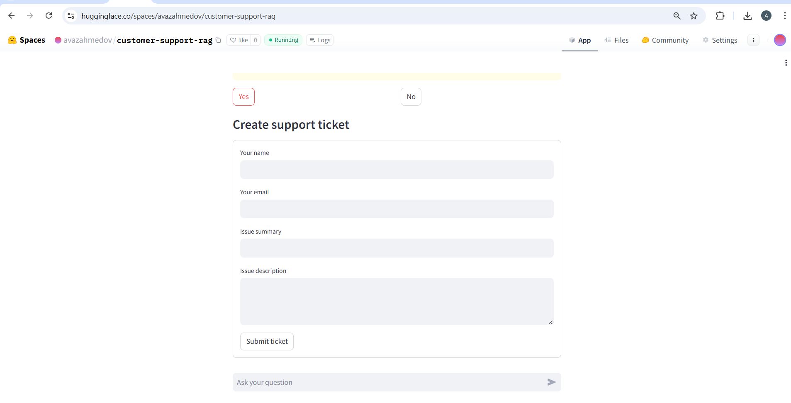
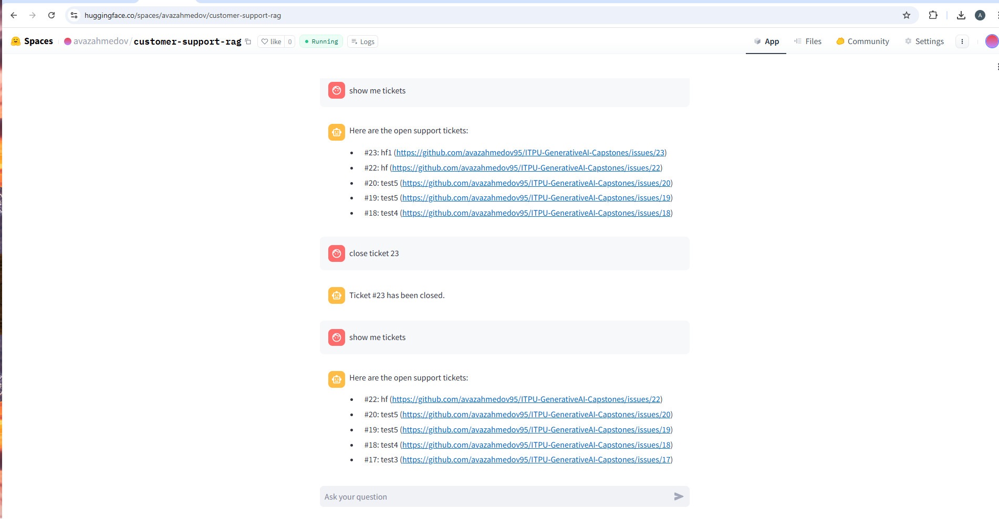

# Customer Support Assistant with RAG & Ticketing

## Overview

This project implements a **Customer Support AI system** that can answer user questions using company documentation and create/manage support tickets when necessary.

The system is based on **Retrieval-Augmented Generation (RAG)** and integrates with an external issue tracking system (GitHub Issues). A web-based chat interface is provided using **Streamlit**.

---

## Key Features

### Retrieval-Augmented Generation (RAG)
- Uses FAISS vector store for semantic search
- Answers are generated **only from indexed documents**
- Each answer cites the exact **document name and page number**

### Conversational Chat
- Web chat UI built with Streamlit
- Conversation history is preserved in session state
- Deterministic responses (temperature = 0)

### Support Ticket Management
- If information is not found, the system suggests creating a support ticket
- Users can explicitly request ticket creation
- Support tickets are created as **GitHub Issues**

### Function Calling
- Native OpenAI function calling is used
- LLM decides **when** to invoke backend functions
- Supported function calls:
  - List support tickets
  - Close support tickets

---

## Supported Vehicles

The assistant can answer questions **only** for the following vehicles:

- **2023 Toyota Corolla Cross**
- **2023 Toyota Corolla Hybrid**
- **2025 Toyota Corolla Hatchback**

Questions about unsupported vehicles are not answered from documentation and will trigger a ticket suggestion instead.

---

## Data Sources

The system uses at least **three documents** as a knowledge base:

- `2023-toyota-corolla-cross.pdf`
- `2023-toyota-corolla-hybrid.pdf`
- `2025-corolla-hatchback.pdf`

---

## System Workflow

1. User asks a question via the web chat
2. The system:
   - Detects user intent (general / support / ticket management)
   - Retrieves relevant document chunks using FAISS
3. If information is found:
   - Generates an answer with document citation
4. If information is not found or the vehicle is unsupported:
   - Asks the user whether they want to create a support ticket
5. Ticket management actions:
   - Listing or closing tickets is handled via LLM function calling
6. Ticket creation:
   - Requires explicit user confirmation and form input
   - Tickets are created as GitHub Issues

---
## How to Run the Project

Follow the steps below to run the Customer Support Assistant locally.

### Install dependencies

```pip install -r requirements.txt```

### Configure environment variables
Create a `.env` file in the project root or in your system with the following content:

```
OPENAI_API_KEY=your_openai_api_key
GITHUB_TOKEN=your_github_token
GITHUB_REPO=github_username/repository_name
```
### Prepare the data
Place all required PDF documents into the data/ directory

### Build the FAISS vector index
This step parses the PDF documents, splits them into chunks, generates embeddings,
and stores them in a FAISS vector database.

```python ingestion/build_index.py```

After successful execution, the vector index will be created in:

```vectorstore/faiss_index/```

### Run the application

```streamlit run app.py```

### Open the application in your browser
After run, Streamlit will display a local URL, usually:

```http://localhost:8501```

---

## Screenshots / Demo


















---

## Repository for this project

https://github.com/avazahmedov95/capstone_RAG

